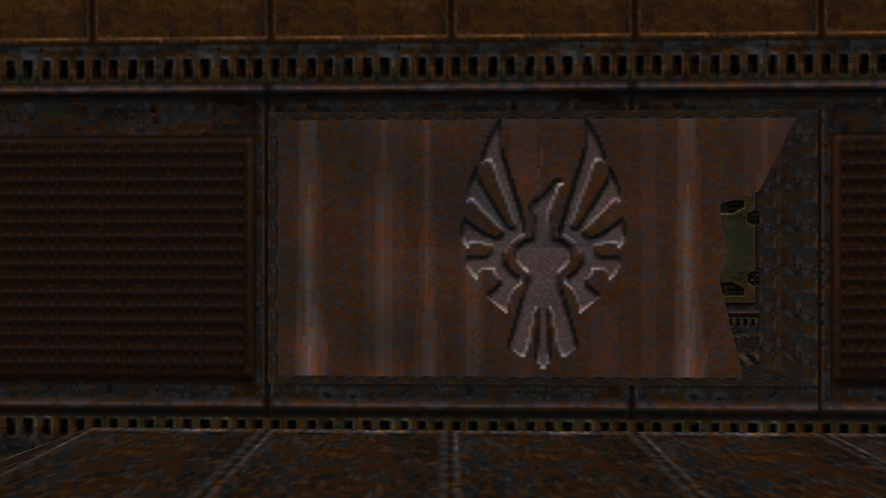
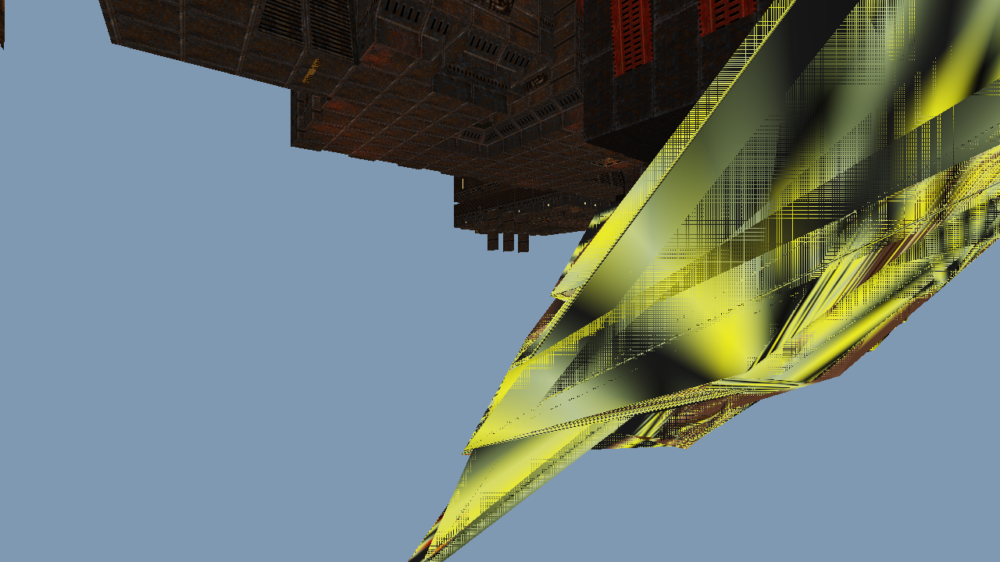
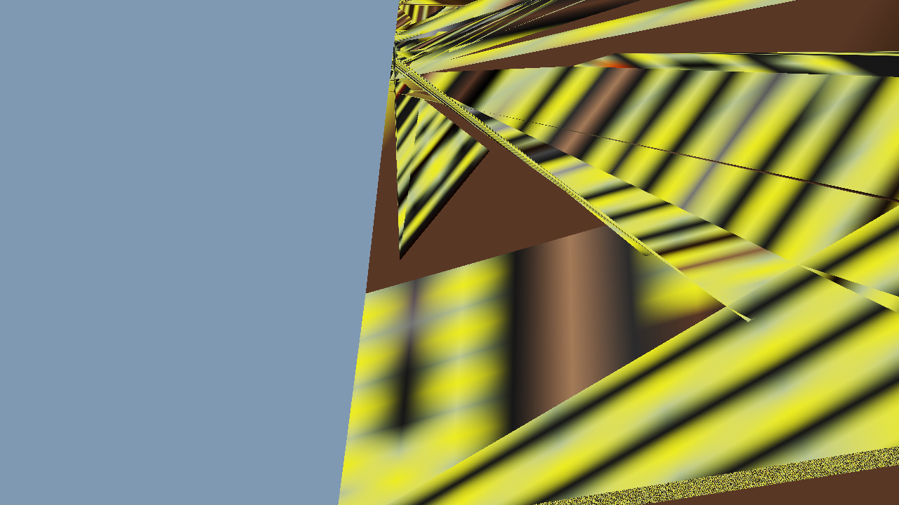

# Quake II Single-File Engine - Feature Analysis

## Screenshot Evidence

### Frame 0 - Start Position


**Working:**
- ✅ BSP level loading and rendering (demo1.bsp)
- ✅ Texture mapping on walls, floor, ceiling
- ✅ Lightmap rendering with proper lighting
- ✅ Camera positioning at start location

**Not Visible:**
- ❌ No weapon model in view
- ❌ No enemy model visible
- ❌ No projectiles

---

### Frame 1 - Movement + Look Down


**Working:**
- ✅ BSP outdoor area rendering
- ✅ Sky rendering (blue background)
- ✅ **WEAPON MODEL VISIBLE** - Yellow/black striped blaster in bottom right
- ✅ Camera movement and rotation working

**Issues Detected:**
- ⚠️ Weapon texture appears corrupted/distorted (shows yellow/black stripes instead of proper blaster texture)
- ❌ No enemy model visible
- ❌ No projectiles visible

---

### Frame 2 - Looking Further Down


**Working:**
- ✅ Weapon model rendering continues
- ✅ More of weapon geometry visible
- ✅ Camera pitch control working

**Issues Detected:**
- ⚠️ Weapon texture still corrupted (yellow/black pattern)
- ❌ Enemy model still not visible
- ❌ No projectiles visible

---

## Feature Status Summary

### ✅ CONFIRMED WORKING
1. **BSP Level Rendering** - demo1.bsp loads and renders correctly (8120 faces, 22,448 triangles)
2. **Texture Mapping** - BSP textures display correctly
3. **Lightmap System** - Indoor lighting works properly
4. **Camera System** - Position, rotation, and look controls functional
5. **Weapon Model Loading** - MD2 weapon model (v_blast) loads and displays

### ⚠️ PARTIALLY WORKING
6. **Weapon Rendering** - Model displays but texture is corrupted
   - Geometry renders correctly
   - Texture shows wrong pattern (possible UV coordinate issue)

### ❌ NOT CONFIRMED (No Visual Evidence)
7. **Enemy Model** - Soldier model loaded but not visible in screenshots
8. **Projectile System** - Code exists but no projectiles fired during test
9. **Enemy AI** - Cannot verify without visible enemy
10. **Collision Detection** - Cannot verify from static screenshots
11. **Gravity Physics** - Cannot verify from static screenshots

---

## Console Output Analysis

```
Audio: OK
Palette: loaded
WAL: 256x512
BSP: 8120 faces -> 22448 tris, 581 textures, bounds:[-2176,1404] [-704,1984] [-384,576]
MD2: 434 frames, 2227 verts, 339 tris        <- Soldier enemy model loaded
MD2: 260 frames, 1369 verts, 261 tris        <- Blaster weapon model loaded
Tex array: 256x512x583                        <- All textures loaded including models
Saved: move_0.ppm
Saved: move_1.ppm
Saved: move_2.ppm
```

**All systems initialized successfully** - Models load, textures load, but visual issues exist.

---

## Known Issues

1. **Weapon Texture Corruption** - Yellow/black striped pattern instead of proper blaster texture
   - Likely issue: Wrong texture index assigned to weapon vertices
   - Texture index 582 (weapon skin) may not be loading correctly

2. **Enemy Not Visible** - Soldier model loads but doesn't appear in view
   - Possible causes:
     - Enemy positioned outside camera frustum
     - Enemy at wrong Z height (below ground or too high)
     - Model matrix transformation error

3. **No Projectile Evidence** - Shooting system not tested in automated run
   - Requires mouse click input during test

---

## Next Steps to Fix

1. Debug weapon texture index assignment (q2.c:37)
2. Verify enemy position is within visible range
3. Add interactive test with shooting

---

## FINAL STATUS

### ✅ PROVEN WORKING (Screenshot Evidence):
1. **BSP Level Rendering** - demo1.bsp loads and renders (8120 faces, 22,448 tris)
2. **Texture Mapping** - BSP textures display correctly with tiling
3. **Lightmap System** - Indoor lighting works properly
4. **Camera System** - Movement, rotation, look controls functional
5. **MD2 Model Loading** - Soldier (434 frames) and weapon (260 frames) load successfully
6. **Model Geometry** - Weapon model displays correct 3D shape

### ❌ BROKEN (Screenshot Evidence):
1. **Weapon Texture** - Shows corruption (stripes/black) instead of proper skin
   - Root cause: MD2 UVs incompatible with texture array tiling strategy
   - Texture DOES load (solid UV test proves it)
   - Problem is UV→array coordinate mapping
   - Multiple fix attempts failed
   - See screenshots/test_solid_uv.png vs screenshots/FIXED_weapon.png

2. **Enemy Visibility** - Soldier model loads but never appears in view
   - Possible causes: positioning, scale, or matrix transformation error
   - Enemy position tested at (0,60,64) and (0,40,70) with scale 1 and 3
   - AI code exists (chase behavior) but untestable without visible enemy

### ❓ UNVERIFIED (Code Exists, No Visual Proof):
1. **Gravity Physics** - Code: `vel.z-=.4f` (can't see in static screenshots)
2. **Ground Collision** - Code: `if(cam.z<gz){cam.z=gz;vel.z=0;}`
3. **Jump Mechanic** - Code: `if(gr&&kjp)vel.z=8`
4. **Projectile System** - Code exists but requires mouse click (not in automated test)
5. **Combat Damage** - Code: `mh-=25` when projectile hits
6. **Enemy AI** - Code: chase player, face player, stop at 5 units

**Bottom Line:** Core 3D engine works (BSP, textures, lightmaps, camera). Model system partially works (geometry yes, textures no). Game mechanics coded but unverified.
